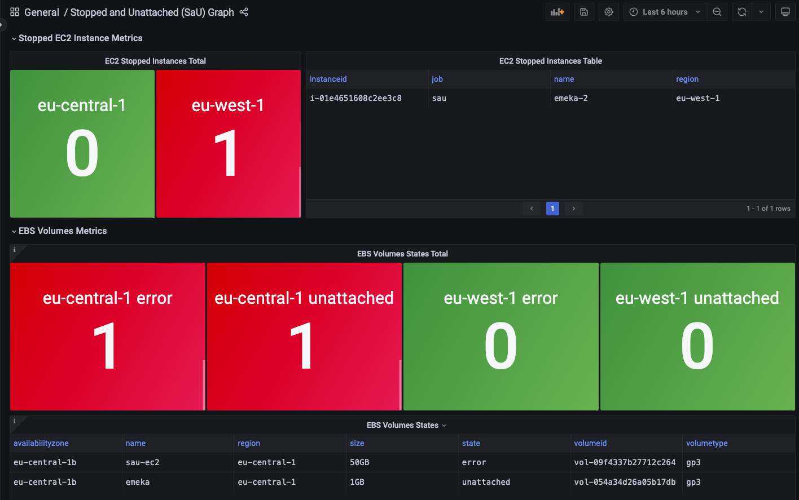

# SaU (Stopped and Unattached) Exporter
[](https://github.com/emylincon/sau/releases)
[](https://github.com/emylincon/sau/actions)
[](https://github.com/emylincon/sau/blob/main/LICENSE)
[](https://github.com/pre-commit/pre-commit)


## Overview

The SaU Exporter is a Python-based application designed to collect and expose AWS EC2 and EBS volume metrics for monitoring and observability. It utilizes the Prometheus client library to provide an HTTP endpoint for scraping metrics.

## Features
* **EC2 Metrics**: Collects information about stopped EC2 instances in different AWS regions.
* **EBS Volume Metrics**: Retrieves data on unattached/errored EBS volumes, including volume state, type, size, and region.
* **Prometheus Integration**: Exposes metrics in the Prometheus format, making it compatible with Prometheus monitoring systems.
* **Exclude Tagging**: Instances and/or volumes tagged with the key "exclude_from_monitoring" with the value True will be omitted as metrics.

## Installing via pip
Pip package is available [here](https://pypi.org/project/sau/)
### Prerequisites:
* Python 3.8+ installed on your system.
* Ensure the required Python libraries are installed by running the following command.
```bash
pip install -r requirements.txt
```
```bash
pip install sau
```
### AWS Credentials
The exporter requires two AWS EC2 permissions, `DescribeInstances` and `DescribeVolumes`. A sample iam policy document can be seen below:
```json
{
    "Version": "2012-10-17",
    "Statement": [
        {
            "Effect": "Allow",
            "Action": [
                "ec2:DescribeInstances",
                "ec2:DescribeVolumes"
            ],
            "Resource": "*"
        }
    ]
}
```
It would be easier to put the creds in a env file. Example `.env` file can be seen below:
```env
AWS_ACCESS_KEY_ID=129QJDNC2OQD09N
AWS_SECRET_ACCESS_KEY=9KXXXXXXXXX
AWS_REGION=eu-central-1
```
then you can source the `.env`
```bash
source .env
```
### Configuration
Create a YAML configuration file with the necessary settings.
### Configuration Options
* **Regions**: Specify the AWS regions for which you want to collect metrics.
* **Exporter Port**: Define the port on which the exporter will expose metrics (default: 9191).
* **Logging Configuration**: Customize logging settings, such as log file directory and retention.
See example below.
```yaml
# list of regions to scrape: REQUIRED
regions:
  - eu-central-1
  - eu-west-1

# exporter port. Defaults to 9191
exporter_port: 9191

# Logging configuration
logging:
  # Number of log files to retain after log rotation
  retention: 7
  # log directory. defaults to current working directory
  directory: "."
  # log level (debug, info, warn, error). Defaults to info
  level: info
```

### Using pip package after installation
```bash
python3 -m sau -c /path/to/config.yaml
```

## Installing using docker
The docker repository is available at [link](https://hub.docker.com/repository/docker/ugwuanyi/sau/general). You will need the following:
* **Config file**: [see Configuration section](#configuration)
* **AWS Credentials**: [see AWS Credentials section](#aws-credentials)
To run the container, use the example command below:
```bash
docker run -ti --env-file .env -v /path/to/config.yaml:/sau/config.yaml ugwuanyi/sau:latest -c /sau/config.yaml
```

## Installing from source:
### Prerequisites:
* Python 3.8+ installed on your system.
* clone the repository
```bash
git clone https://github.com/emylincon/sau.git
```
* Ensure the required Python libraries are installed by running the following command.
```bash
pip install -r requirements.txt
```
You will need the following:
* **Config file**: [see Configuration section](#configuration)
* **AWS Credentials**: [see AWS Credentials section](#aws-credentials)

Execute the exporter by providing the path to the configuration file:

```bash
python3 src/sau/__main__.py -c /path/to/your/config.yaml
```

#### Metrics Endpoint:
Once the exporter is running, metrics can be accessed at `http://localhost:<exporter_port>/`.

## Grafana Dashboard
Grafana dashboard of sample metrics


## Customization
Feel free to extend or customize the exporter to meet your specific requirements. You can modify the provided code or add additional collectors to gather more AWS resource metrics.

## License
This project is licensed under the MIT License. Feel free to use, modify, and distribute it according to the terms of the license.

## Author
Created by Emeka Ugwuanyi. For questions or feedback, please contact me.

## Upgrading version
* enable pr-commit
```bash
pre-commit install
```
* Increament version in [docker/Taskfile](docker/Taskfile.yaml)
* Commiting changes with update all the version references

**Happy monitoring!**
